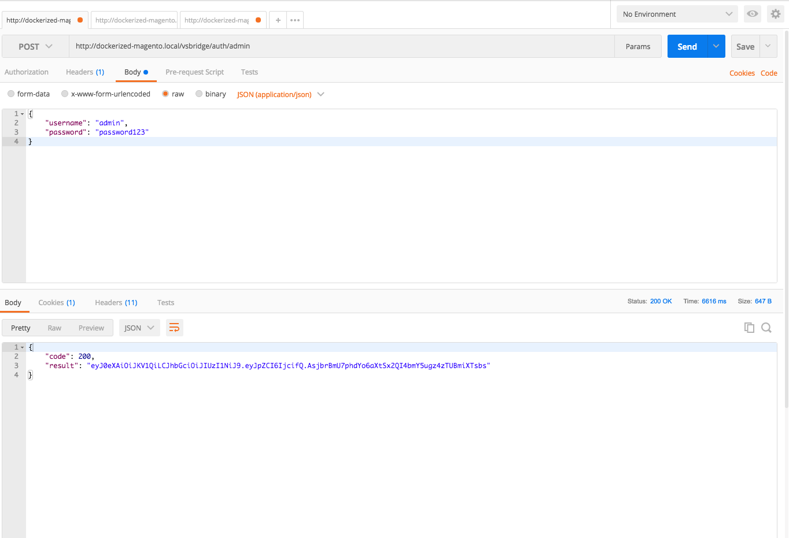

# Vue Storefront support for Magento 1.9
This projects enables You to use Magento 1.9 as a backend platform for [Vue Storefront - first Progressive Web App for e-Commerce](https://github.com/DivanteLtd/vue-storefront). 

[](https://demo-magento1.vuestorefront.io)

Vue Storefront is a standalone PWA storefront for eCommerce. It can be conencted with any eCommerce backend (eg. Magento, Pimcore, Prestashop or Shopware) through the API.

[](https://www.youtube.com/watch?v=L4K-mq9JoaQ)

Sign up for a demo at https://vuestorefront.io/ (Vue Storefront integrated with Magento2 or Magento1).

# Magento 1.9 data bridge
Vue Storefront is platform agnostic - which mean: it can be connected to virtually any eCommerce CMS. This project is a data connector for *Magento 1.9*.

**This bridge at current stage is synchronizing the catalog part: *products, categories, attributes and taxRules*  the missing part is *users, orders and cart* synchronization. If you like to have two way communication just contact us at contributors@vuestorefront.io**.

Areas for improvements:
- performance (right now it's single threaded but can be easily modified to use node-cluster),
- dynamic-requests handling (user accounts, shopping carts, orders).

# Setup and installation
Magento 1.9 bridge uses it's own Magento API which is available as [standard Magento module](https://github.com/DivanteLtd/magento1-vsbridge/tree/master/magento1-module/). The second part is a node.js app which is used to consume the API results.

Requirements: Magento 1.9x Community or Enterprise; Node.js >= 8; [vue-storefront](https://github.com/DivanteLtd/vue-storefront) and [vue-storefront-api](https://github.com/DivanteLtd/vue-storefront-api) installed.

## Magento module setup

First, please clone the whole repository locally:

```
git clone https://github.com/DivanteLtd/magento1-vsbridge.git magento1-vsbridge
cd magento1-vsbridge
cp magento1-module/app/* <MAGENTO_FOLDER>/app/
```

Magento module uses JWT tokens authorization method based on standard Magento admin users account system. **Please create a dedicated admin account** for magento1-bridge purposes only with minimal access (ACL) to the catalog part.

Then, please configure the JWT Secret in Magento configuration: System > Configuration > Services > VueStorefront Bridge.

https://github.com/DivanteLtd/magento1-vsbridge/blob/3f92a6d842e6afb4c7e34e789229848710127b8b/magento1-module/app/code/local/Divante/VueStorefrontBridge/etc/config.xml#L5

Then please clean the Magento cache.
To make sure that the module works just fine You can try to authorize the user using Postman:



## Node app setup

As You've probably noticed in the cloned directory there is a second folder called [`node-app`](https://github.com/DivanteLtd/magento1-vsbridge/tree/master/node-app). This is a consumer application that's responsible for synchronizing the Magento1 data with the ElasticSearch instance.

This tool required ElasticSearch instance up and running. The simplest way to have one is to install [vue-storefront](https://github.com/DivanteLtd/vue-storefront) and [vue-storefront-api](https://github.com/DivanteLtd/vue-storefront-api) and run `docker-compose up` inside `vue-storefront-api` installation as the project [contains Docker file](https://github.com/DivanteLtd/vue-storefront-api/blob/master/docker-compose.yml) for Vue Storefront.

Then you need to modify the configs:

```
cd node-app
cp config.example.json config.json
nano config.json
```

In the config file please setup the following variables:
- [`auth`](https://github.com/DivanteLtd/magento1-vsbridge/blob/5d4b9285c2dd2a20900e6075f50ebc2d7802499e/node-app/config.example.json#L9) section to setup Magento's user login and password and the previously set [JWT secret](https://github.com/DivanteLtd/magento1-vsbridge/blob/5d4b9285c2dd2a20900e6075f50ebc2d7802499e/magento1-module/app/code/local/Divante/VueStorefrontBridge/etc/config.xml#L6)
- ['endpoint'](https://github.com/DivanteLtd/magento1-vsbridge/blob/5d4b9285c2dd2a20900e6075f50ebc2d7802499e/node-app/config.example.json#L14) should match your Magento 1.9 URL,
- [`elasticsearch.indexName`](https://github.com/DivanteLtd/magento1-vsbridge/blob/5d4b9285c2dd2a20900e6075f50ebc2d7802499e/node-app/config.example.json#L4) should be set to Your ElasticSearch index which then will be connected to the Vue Storefront. It can be fresh / non-existient index as well (will be created then). For example You may have: `vue_storefront_mangento1`

## Vue Storefront setup

**Please note:** current version of magento1-vsbridge requires the latest version of VS, from ['develop' branch installed](https://github.com/DivanteLtd/vue-storefront/tree/develop). Please make sure youre using the most recent code.

By default Vue Storefront uses ES index named `vue_storefront_catalog`. Please apply the changes accordingly to:
- `vue-storefront` [config file](https://github.com/DivanteLtd/vue-storefront/tree/master/config) `local.json` to point to right index name,
- `vue-storefront-api` [config file](https://github.com/DivanteLtd/vue-storefront-api/tree/master/config) `local.json` to point to right index name.

Restart `vue-storefront` and `vue-storefront-api`.

# Available commands
The bridge works on temporary, versioned ES indexes. You decide when the index should be published (when all data objects are properly set). All commands exec from `node-app/src` directory.

Create new version of index (for example: vue_storefront_mangento1_1): 
```
cd node-app/src
node index.js new
```

Index data:
```
node index.js attributes
node index.js taxrules
node index.js categories
node index.js products
```

Publish new version of index (creates an alias with prod. name of the index: vue_storefront_magento1_1 -> vue_storefront_magento1): 
```
node index.js publish
```

Congratulations! After this step You should have got the ES index synchronized with the Magento1 instance!

# Screenshots

Please visit [Vue Storefront site](http://vuestorefront.io) to check out why it's so cool!


As you may observed, configured products do work perfectly well after imported to Vue Storefront!


# Customization & contributions
Please feel free to extend Magento module or Node app and contribute Your changes to the community!

Some ideas for contributions:
- media gallery sync,
- shopping cart / order sync (please [contact us for details](contributors@vuestorefront.io)).

# License 
`magento1-vsbridge` source code is completely free and released under the [MIT License](https://github.com/DivanteLtd/vue-storefront/blob/master/LICENSE).

